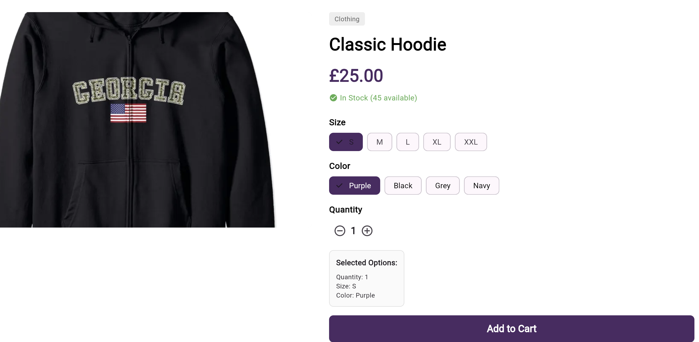
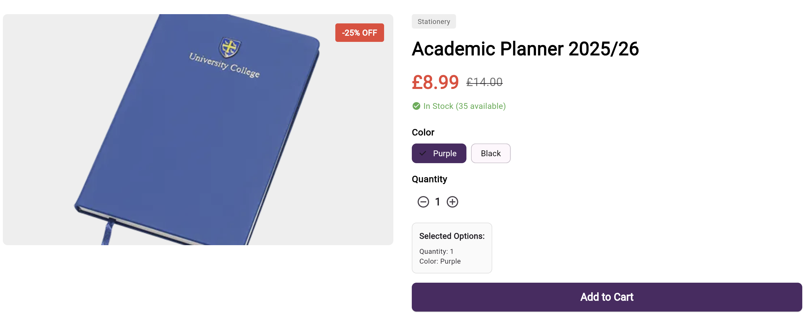
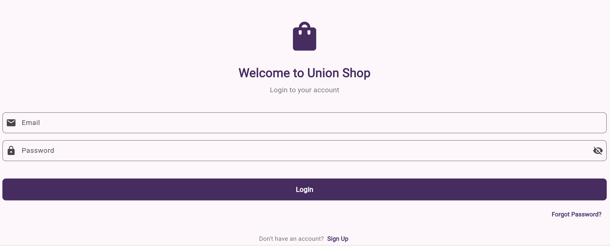
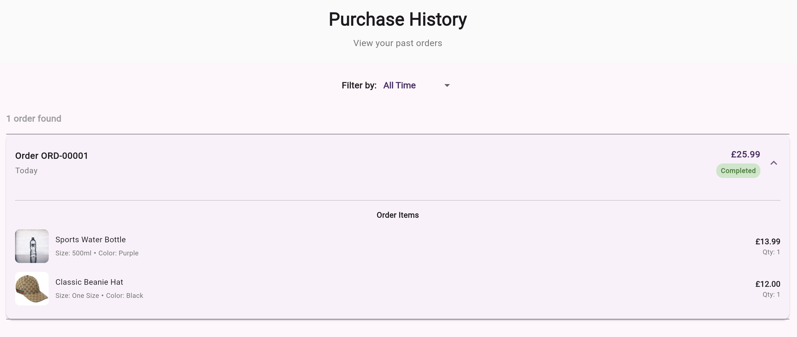
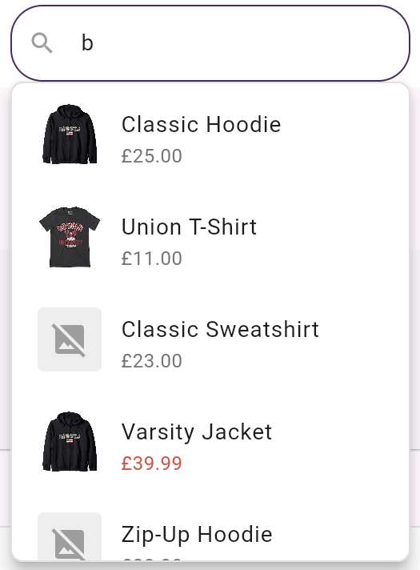
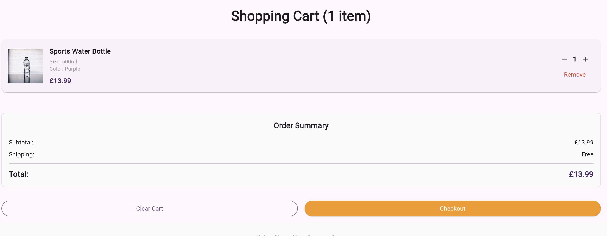
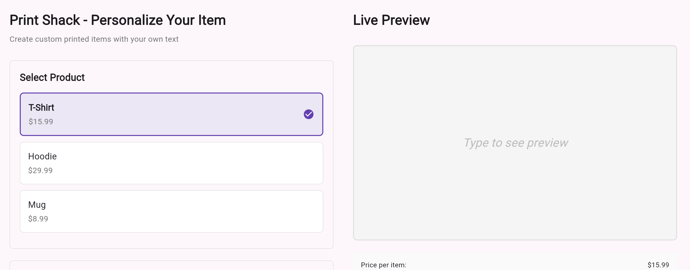

# Union Shop - E-Commerce Flutter Application

A fully functional e-commerce Flutter application built for the University of Portsmouth Student Union shop. This project recreates the UPSU shop experience with modern features including product browsing, shopping cart, custom print services, and responsive design across all platforms.

[](https://flutter.dev)
[](https://dart.dev)
[](./coverage)
[](./test)

---

## 📋 Table of Contents
- [Features](#-features)
- [Screenshots](#-screenshots)
- [Installation](#-installation--setup)
- [Usage](#-usage)
- [Project Structure](#-project-structure)
- [Technologies Used](#-technologies-used)
- [Testing](#-testing)
- [Known Issues](#-known-issues--future-improvements)
- [Contact](#-contact)

---

## ✨ Features

### Core Functionality
- 🏠 **Home Page** with featured products and collections
- 🛍️ **Product Catalog** with 24+ products across multiple categories
- 🔍 **Advanced Search** with real-time product filtering
- 🛒 **Shopping Cart** with quantity management and price calculation
- 📦 **Product Collections** organized by category (Clothing, Accessories, Stationery)
- 💰 **Sale Section** showcasing discounted items
- 🎨 **Print Shack** custom printing service with text customization

### User Experience
- 📱 **Fully Responsive Design** (Mobile, Tablet, Desktop)
- 🎯 **SEO-Friendly URLs** with product name slugs (e.g., `/product/classic-hoodie`)
- 🔔 **Stock Status Indicators** showing availability in real-time
- 💳 **Purchase History** tracking past orders
- 🎨 **Color & Size Selection** for customizable products
- ⚡ **Fast Navigation** with GoRouter-based routing

### Technical Highlights
- ✅ **84.58% Test Coverage** with 280 passing tests
- 🎨 **Material Design 3** UI components
- 📊 **State Management** using Provider
- 🔄 **Reactive Updates** across the entire application
- 📱 **Cross-Platform** (Web, Android, iOS, Windows, macOS, Linux)

---

## 📸 Screenshots

### Product Page




# Authentication 


# History


# Searching


### Shopping Cart


### Print Shack


*Note: Screenshots to be added*

---

## 🚀 Installation & Setup

### Prerequisites

Before you begin, ensure you have the following installed:
- **Flutter SDK** (3.0 or higher) - [Install Flutter](https://docs.flutter.dev/get-started/install)
- **Dart SDK** (3.0 or higher) - Comes with Flutter
- **Git** - [Install Git](https://git-scm.com/downloads)
- **IDE**: Visual Studio Code or Android Studio
- **Platform-specific requirements**:
  - **Windows**: Visual Studio 2022 with C++ tools (for Windows desktop)
  - **macOS**: Xcode (for iOS/macOS development)
  - **Linux**: Standard development tools

### Step 1: Clone the Repository

```bash
git clone https://github.com/Marinos551/union_shop.git
cd union_shop
```

### Step 2: Install Dependencies

```bash
flutter pub get
```

### Step 3: Verify Installation

```bash
flutter doctor
```

This will check your environment and display any missing requirements.

### Step 4: Run the Application

#### For Web
```bash
flutter run -d edge
# or
flutter run -d chrome
```

#### For Windows
```bash
flutter run -d windows
```

#### For Android/iOS
```bash
flutter run
# Select your device when prompted
```

---

## 💡 Usage

### Running the Application

1. **Start the app** using the commands above
2. **Browse products** from the home page or search bar
3. **View product details** by clicking on any product card
4. **Add items to cart** with size/color selection
5. **Manage cart** by adjusting quantities or removing items
6. **Place orders** through the checkout process

### Key User Flows

#### Browsing Products
1. Navigate to **Collections** to browse by category
2. Use the **Search** bar to find specific products
3. Click on **Sale** to view discounted items

#### Making a Purchase
1. Select a product to view details
2. Choose **size** and **color** (if available)
3. Select **quantity**
4. Click **Add to Cart**
5. View cart by clicking the cart icon (top right)
6. Review items and proceed to checkout

#### Using Print Shack
1. Navigate to **Print Shack** from the header
2. Select a product (e.g., T-Shirt, Hoodie)
3. Enter custom text
4. Choose font style and color
5. Select quantity
6. Add to cart

### Running Tests

```bash
# Run all tests
flutter test

# Run tests with coverage
flutter test --coverage

# Run specific test file
flutter test test/product_test.dart
```

### Configuration

The app uses local data stored in `lib/data/collections_data.dart`. You can modify products, prices, and availability there.

---

## 📁 Project Structure

```
union_shop/
├── lib/
│   ├── main.dart                     # App entry point & routing
│   ├── data/
│   │   └── collections_data.dart     # Product data & collections
│   ├── models/
│   │   ├── product_model.dart        # Product data model with slug generation
│   │   ├── cart_model.dart           # Cart item model
│   │   ├── cart_service.dart         # Cart state management
│   │   ├── collection_model.dart     # Collection data model
│   │   ├── order_model.dart          # Order/purchase model
│   │   └── print_shack_model.dart    # Custom print data model
│   ├── views/
│   │   ├── about_page.dart           # About/company info page
│   │   ├── auth_page.dart            # Login/authentication page
│   │   ├── cart_page.dart            # Shopping cart page
│   │   ├── collection_products_page.dart  # Collection product listing
│   │   ├── collections_page.dart     # All collections page
│   │   ├── common_page_scaffold.dart # Reusable page layout
│   │   ├── print_shack_page.dart     # Custom printing service
│   │   ├── print_shack_about_page.dart
│   │   ├── product_page.dart         # Individual product details
│   │   ├── purchase_history_page.dart # Order history
│   │   └── sale_collection_page.dart # Sale items page
│   └── widgets/
│       ├── header_widget.dart        # App navigation header
│       └── footer_widget.dart        # App footer
├── assets/
│   └── images/                       # Product images
├── test/                             # Test files (280 tests)
├── coverage/                         # Coverage reports
├── pubspec.yaml                      # Dependencies
└── README.md                         # This file
```

### Key Files

- **`main.dart`**: Application entry point, defines routing structure with GoRouter
- **`collections_data.dart`**: Contains all product data (24 products across 5 collections)
- **`cart_service.dart`**: Manages shopping cart state using Provider
- **`product_model.dart`**: Defines product structure with slug generation for SEO-friendly URLs
- **`header_widget.dart`**: Responsive navigation with search functionality

---

## 🛠️ Technologies Used

### Framework & Language
- **Flutter** 3.0+ - Cross-platform UI framework
- **Dart** 3.0+ - Programming language

### Key Packages

#### State Management
- [`provider`](https://pub.dev/packages/provider) ^6.1.2 - State management solution

#### Navigation
- [`go_router`](https://pub.dev/packages/go_router) ^14.6.2 - Declarative routing

#### UI Components
- [`flutter/material`](https://flutter.dev) - Material Design 3 widgets

#### Testing
- [`flutter_test`](https://flutter.dev) - Flutter testing framework
- [`mockito`](https://pub.dev/packages/mockito) - Mocking framework for tests

### Development Tools
- **Visual Studio Code** - Primary IDE
- **Flutter DevTools** - Debugging and performance profiling
- **Git** - Version control
- **GitHub** - Repository hosting

### Supported Platforms
- ✅ Web (Chrome, Edge, Firefox)
- ✅ Windows Desktop
- ✅ Android
- ✅ iOS
- ✅ macOS
- ✅ Linux

---

## 🧪 Testing

### Test Coverage: 84.58%

The application includes comprehensive testing:

- **280 tests** covering all major functionality
- **Unit tests** for models and services
- **Widget tests** for UI components
- **Integration tests** for user flows

### Coverage by Component

| Component | Coverage | Status |
|-----------|----------|--------|
| Product Model | 100% | ✅ Perfect |
| Cart Model | 100% | ✅ Perfect |
| Order Model | 100% | ✅ Perfect |
| Purchase History | 100% | ✅ Perfect |
| Product Page | 96.59% | ✅ Excellent |
| Collection Products | 97.16% | ✅ Excellent |
| Auth Page | 96.40% | ✅ Excellent |
| Header Widget | 81.51% | ✓ Good |
| Cart Page | 90.60% | ✓ Good |
| Main App | 62.15% | ⚠️ Needs improvement |

### Running Tests

```bash
# Run all tests
flutter test

# Run with coverage
flutter test --coverage

# Run specific test suite
flutter test test/product_test.dart
flutter test test/cart_page_test.dart
flutter test test/header_widget_test.dart
```

### View Coverage Report

After running tests with `--coverage`, you can view the detailed HTML report:

```bash
# Generate HTML coverage report (requires lcov)
genhtml coverage/lcov.info -o coverage/html

# Open the report
# Windows
start coverage/html/index.html

# macOS
open coverage/html/index.html

# Linux
xdg-open coverage/html/index.html
```

---

## ⚠️ Known Issues & Future Improvements

### Known Issues
- Some tap tests show warnings for off-screen elements (non-breaking)
- Windows desktop build requires Visual Studio toolchain

### Planned Improvements
- 🔐 **User Authentication** - Complete login/register functionality
- 💳 **Payment Integration** - Stripe/PayPal checkout
- 📧 **Email Notifications** - Order confirmations
- 🎨 **Dark Mode** - Theme switching capability
- 📊 **Admin Dashboard** - Product management interface
- 🌐 **Multi-language Support** - Internationalization (i18n)
- 📱 **Push Notifications** - Order updates
- ⭐ **Product Reviews** - User ratings and reviews
- 🔖 **Wishlist Feature** - Save favorite products
- 🚚 **Order Tracking** - Shipping status updates

### Contributing
This is an academic project, but suggestions and feedback are welcome! Feel free to open an issue or submit a pull request.

---

## 📄 License

This project is part of academic coursework for the University of Portsmouth.

**Modules:**
- Programming Applications and Programming Languages (M30235)
- User Experience Design and Implementation (M32605)

---

## 👤 Contact

**Marinos**
- GitHub: [@Marinos551](https://github.com/Marinos551)
- Repository: [union_shop](https://github.com/Marinos551/union_shop)

---

## 🙏 Acknowledgments

- University of Portsmouth Student Union for the original design inspiration
- Flutter team for the excellent framework
- Module instructors for guidance and support

---

## 📚 Additional Resources

- [Flutter Documentation](https://docs.flutter.dev/)
- [Dart Language Tour](https://dart.dev/guides/language/language-tour)
- [Provider Package Documentation](https://pub.dev/packages/provider)
- [GoRouter Documentation](https://pub.dev/packages/go_router)
- [Material Design Guidelines](https://m3.material.io/)

---

**Last Updated:** December 5, 2025 (2:01 AM)

**Version:** 1.0.0


- Install [Homebrew package manager](https://brew.sh/)
- Run in Terminal:

  ```bash
  brew install --cask visual-studio-code flutter
  ```

After installation, verify your setup by running:

```bash
flutter doctor
```

This command checks your environment and displays a report of the status of your Flutter installation.


Made with ❤️ by Marinos
